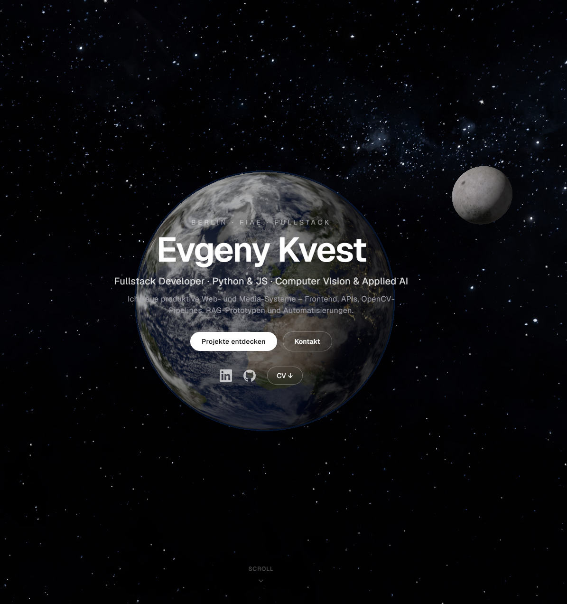
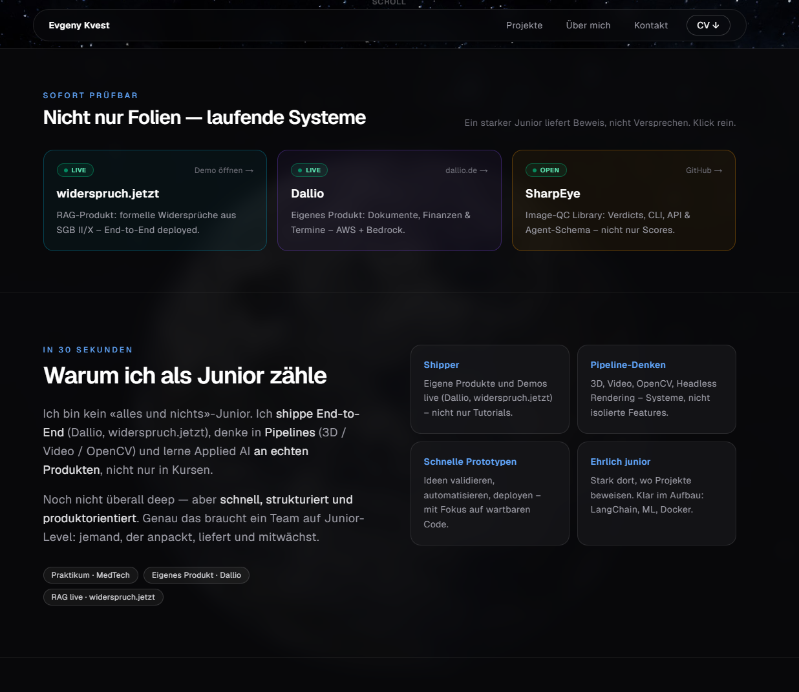

# Portfolio – Evgeny Kvest

Interaktives 3D-Portfolio für Fullstack-Entwicklung mit Fokus auf **Python & JavaScript**, **Computer Vision**, **Applied AI / RAG** und **Cloud**.

**Live:** [portfolio-tawny-nine-79.vercel.app](https://portfolio-tawny-nine-79.vercel.app)

---

## Screenshots

| Hero · 3D-Globus | Projekte · Featured Cases |
|:--:|:--:|
|  |  |

---

## Überblick

| | |
|--|--|
| **Rolle** | Fullstack Developer · FIAE · Berlin |
| **Fokus** | Python & JS · Computer Vision · Applied AI |
| **Stack** | Next.js 16, React 19, Three.js, Framer Motion, Tailwind 4 |
| **Hosting** | Vercel (Analytics + Speed Insights) |

Hero: Echtzeit-Erde (GLSL Day/Night, Wolken, Fresnel-Atmosphäre, Bloom, Mond, Parallax).  
Darunter: Live-Proof, „Warum ich“, Featured Cases, interaktive Schärfe-Demo, Skills & Soft Skills, Kontakt.

---

## Features

### Experience
- **3D-Hero** mit Custom GLSL (Day/Night, Normal Map), Bloom, Scroll-Dolly, Mouse-Parallax
- Loading mit Progress + Brand-Line (*Building systems, not slides…*)
- Sticky Glass-Navigation (Desktop)
- **Live-Proof Strip** — widerspruch.jetzt, Dallio, SharpEye (ein Klick)
- **„Warum ich als Junior zähle“** — Shipper / Pipelines / Prototypen / ehrlich im Aufbau
- Featured Case Studies: Use Case → Ergebnis → Architektur → Metrics
- **MP4-Previews** für Product-Cases (Dallio, widerspruch.jetzt)
- Praxisprojekte: Badge + Architektur/Fakten (kein vollständiger Production-Code)
- **Live Computer-Vision-Demo** — Laplacian-Schärfe im Browser (kein Upload)
- Skills in 3 Stufen: Core · Specialties · Im Aufbau
- Soft Skills / Arbeitsweise
- Rollen-Fit: Frontend · Backend · Fullstack · Cloud · Applied AI · Computer Vision
- Kontakt: mailto, Copy-Email, Availability
- Impressum & Datenschutz im Portfolio-Design

### Technik / Performance
- Dynamic import für Three.js (`ssr: false`)
- DPR-Cap, RAF-Pause offscreen, dispose on unmount
- `prefers-reduced-motion`
- Mobile: Overflow-sichere Cards, kein 3D-Tilt auf Touch

---

## Projekte im Portfolio

| Projekt | Art | Fokus | Link |
|---|---|---|---|
| **widerspruch.jetzt** | Product · Live | RAG / FastAPI / SGB II+X | [Demo](https://sgb2-rag-production.up.railway.app/ui/) · [GitHub](https://github.com/SkoofyDoo/widerspruch.jetzt) |
| **3D-Vorschau-Pipeline** | Praxis | Headless WebGL, Modellschutz | [Architektur](https://github.com/SkoofyDoo/3D-Vorschau-Pipeline-Headless-Rendering-Approval-Workflow) |
| **Dallio** | Product · Live | Document AI (AWS Bedrock) | [dallio.de](https://dallio.de) · [GitHub](https://github.com/SkoofyDoo/Dallio) |
| **SharpEye** | Product | Image QC (CLI / API / Agents) | [GitHub](https://github.com/SkoofyDoo/sharpeye) |
| **Client-Based-VideoSlicer** | Praxis | Frame-Extraktion im Browser | [Architektur](https://github.com/SkoofyDoo/Client-Based-VideoSlicer) |
| **Automatisierte Schärfe-Analyse** | Praxis | Server-side OpenCV.WASM QC | [Architektur](https://github.com/SkoofyDoo/Automatisierte-Schaerfe-Analyse) |

**Praxis:** Architektur & Fakten auf GitHub — vollständiger Production-Code nicht öffentlich.

---

## Tech Stack

- **Framework:** [Next.js](https://nextjs.org/) 16 (App Router), React 19  
- **3D:** [Three.js](https://threejs.org/) + EffectComposer / UnrealBloomPass  
- **Motion:** [Framer Motion](https://www.framer.com/motion/)  
- **UI:** [Tailwind CSS](https://tailwindcss.com/) 4  
- **Analytics:** Vercel Analytics & Speed Insights  

---

## Development

```bash
npm install
npm run dev      # http://localhost:3000
```

```bash
npm run build
npm start
```

```bash
npm run lint
```

---

## Struktur

```text
src/
  app/                 # App Router (page, layout, impressum, datenschutz)
  components/          # HeroScene, Projects, VisionDemo, About, Contact, LegalShell…
  data/
    projects.js        # Cases, metrics, media (MP4 paths)
    skills.js          # Core / Specialties / Learning + Soft Skills
public/
  projects/            # MP4 / Poster pro Projekt
    dallio/dallio.mp4
    widerspruch-jetzt/widerspruch.mp4
  *.jpg / star.png     # 3D-Texturen
  EvgenyKvest_CV.pdf
docs/
  screenshots/         # README: hero.png, projects.png
```


---

## Legal

- [Impressum](https://portfolio-tawny-nine-79.vercel.app/impressum)  
- [Datenschutz](https://portfolio-tawny-nine-79.vercel.app/datenschutz)  

---

## Author

**Evgeny Kvest** · Berlin  
Fullstack Developer · Python & JS · Computer Vision & Applied AI  

- LinkedIn: [evgeny-kvest](https://www.linkedin.com/in/evgeny-kvest-978137345/)  
- GitHub: [SkoofyDoo](https://github.com/SkoofyDoo)  
- E-Mail: evgenykvest@gmail.com  
